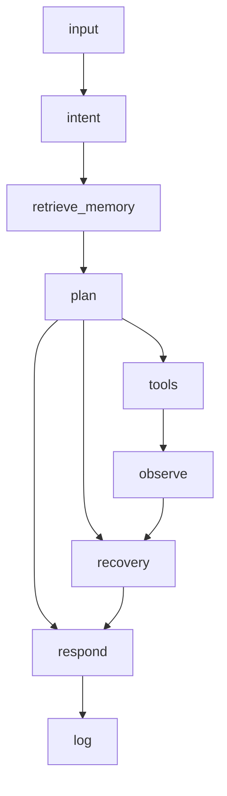

# Final Capstone Report — M.I.K.U. Desktop Assistant

## 1. Project Title

**M.I.K.U.: A Gesture- and Voice-Controlled Desktop Personal Assistant with Traceable LangGraph Agent Workflows**

## 2. Problem and User

Students and knowledge workers juggle study tools (music, timer, notes, checklists) and web search across many tabs. MIKU provides hands-free control via gestures and voice with observable, safe agent actions.

## 3. System Goal and Scope

**Goals:** Wake/sleep, voice commands, Study Mode, search, music preference recovery, full traces.

**Out of scope:** Shell access, file deletion, multi-device sync, production speech accuracy.

## 4. Architecture

See `backend/graph.py`, `README.md`.

## 5. Design Evolution (Modules 1–6)

| Module | Addition |
|--------|----------|
| 1 | FastAPI + commands |
| 2 | LangGraph ReAct-style loop |
| 3 | `memory.json` + `study_mode_kb.json` |
| 4 | ToT candidate scoring in `plan_node` |
| 5 | Role-specialized nodes (recovery, tools) |
| 6 | `safety.py` + `logs.json` observability |

## 6. Implementation

FastAPI (`main.py`), LangGraph (`graph.py`), LangChain tools (`tools.py`), browser MediaPipe (`frontend/gestures-client.js`), Web Speech API, edge-tts, JSON memory.

## 7. Evaluation

`python scripts/run_eval.py` — 7/7 tests pass. See `docs/EVALUATION_RESULTS.md`.

## 8. Safety

URL whitelist, keyword input filter, human thumbs-up approval for music preferences.

## 9. Limitations and Next Steps

Gesture/speech accuracy, no vector RAG, role-based nodes vs true multi-agent. Future: local LLM, automated CI, expanded tools.
